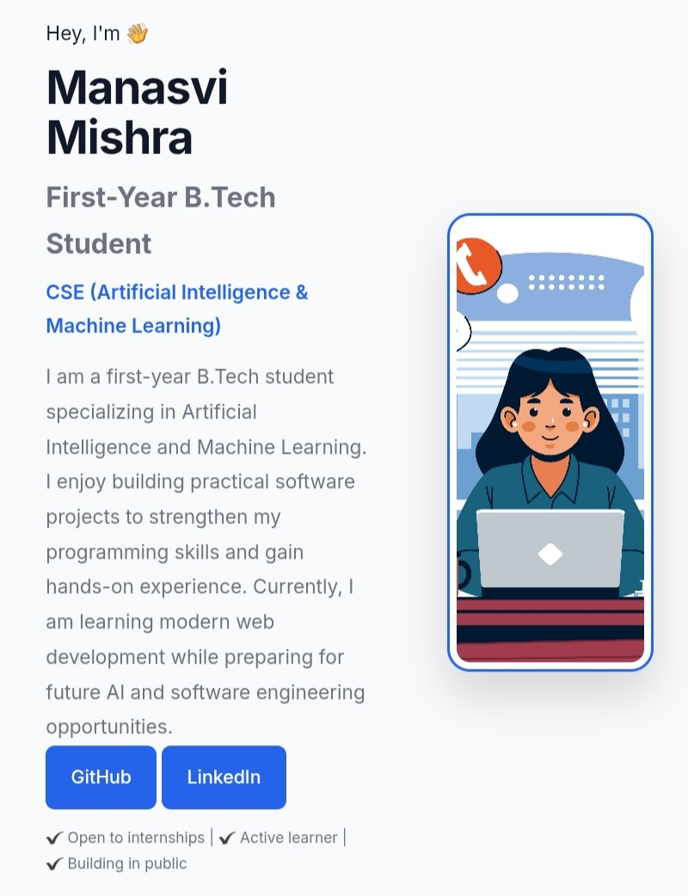

# 🌐 Personal Portfolio

A modern, responsive personal portfolio website built using **HTML, CSS, and JavaScript**.  
This project showcases my profile, technical skills, projects, and learning journey as an aspiring Software Engineer.

---

## 🚀 Live Website

🔗 https://manasvimishraa-portfolio.netlify.app

---

## 👩‍💻 About Me

Hi, I'm **Manasvi Mishra**, a first-year B.Tech student specializing in **Computer Science Engineering (Artificial Intelligence & Machine Learning)**.

I am passionate about software development and I enjoy learning by building real-world projects. My current focus is on frontend development, while preparing for software engineering and AI opportunities.

---

## ⏳ Project Timeline

This project was built during my transition period after completing my 12th grade and before starting my B.Tech in Computer Science Engineering (AI & ML), which begins in late July.

During this pre-college phase, I dedicated my time to learning web development and building this portfolio from scratch using HTML, CSS, and JavaScript.

This project reflects my initiative, consistency, and early interest in software development before formal university education.

---

## ✨ Features

- Fully responsive design (mobile + desktop)
- Modern UI with clean layout
- Dark mode toggle
- Smooth scrolling navigation
- Interactive project cards
- Mobile-friendly structure
- Contact links (Email, GitHub, LinkedIn)

---

## 🛠️ Tech Stack

- HTML5
- CSS3 (Flexbox + Grid)
- JavaScript (ES6)
- Google Fonts (Inter)

---

## 📂 Project Structure

```
personal-portfolio/
│
├── index.html
├── style.css
├── script.js
├── images/
│   └── profile.jpg
└── README.md
```

---

## 📸 Preview



---

## 📌 Future Improvements

- Add more real-world projects (To-Do App, Weather App, etc.)
- Add backend integration for contact form
- Improve animations and transitions
- Add project filtering system
- Add downloadable resume
- Deploy custom domain

---

## 📫 Contact

📧 Email: manasvimishraa2008@gmail.com  

💻 GitHub: https://github.com/manasvimishra03

💼 LinkedIn: https://linkedin.com/in/manasvi-mishra03

---

## 📄 License

This project is created for learning and portfolio purposes.

---
